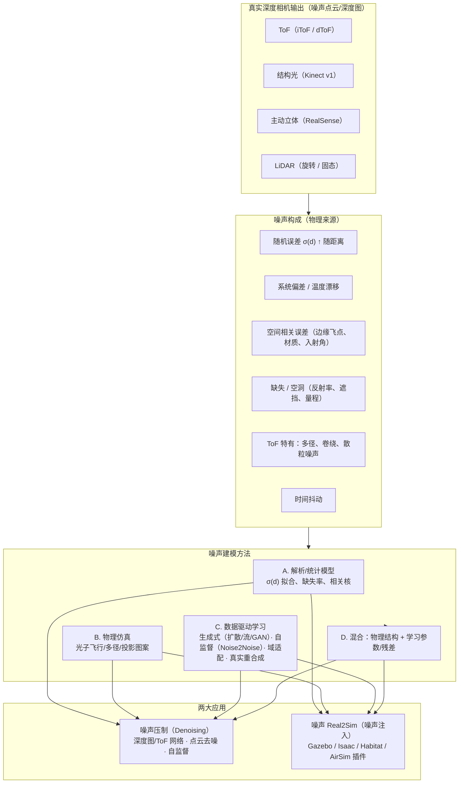
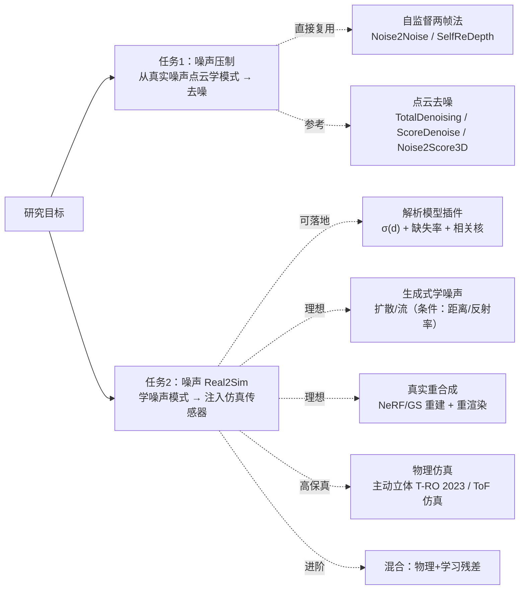

# 研究分类图谱（Taxonomy）

深度相机噪声研究的整体分类，以及"学习真实噪声 → 噪声压制 / Real2Sim"两条主线在其中的位置。

## 1. 总览图

## 2. 方法路线对比

| 路线 | 代表工作 | 保真度 | 成本 | 落地难度 | 适用传感器 |
|---|---|---|---|---|---|
| A. 解析/统计模型 | Khoshelham 2012；Nguyen 2012；Plozza 2024；Habitat Redwood 模型 | 中（随机误差好，缺失/多径差） | 极低 | 极低（直接做插件） | 全部（需逐型号标定） |
| B. 物理仿真 | Keller 2007；AMCW ToF 2018；主动立体 T-RO 2023；车规 LiDAR 2025 | 高 | 高（渲染+标定） | 中 | ToF、主动立体、LiDAR |
| C1. 生成式学噪声 | Noise Flow；RNSD（扩散）；SIDD | 高（学到的分布） | 中（需真实数据） | 中 | RGB 成熟，深度/点云空白 |
| C2. 自监督两帧 | Noise2Noise；SelfReDepth | 高（去噪目标） | 低（无需真值） | 低 | 深度图/点云 |
| C3. 域适配注入 | Project to Adapt；Adversarial Masking；S2R-DepthNet | 中高 | 中 | 中 | 深度、点云 |
| C4. 真实重合成 | LiDARsim | 高（噪声天然真实） | 高（需场景重建） | 中高 | LiDAR（可迁移至 RGB-D） |
| D. 混合 | 物理仿真 + 学习标定/残差（目前公开工作少） | 高 | 中高 | 中 | 全部（**建议重点探索**） |

## 3. 与"用户研究目标"的映射

> 推荐起点：**任务2 用路线 A 快速落地 + 路线 C1 做研究增量；任务1 用路线 C2 起步**。详见 [roadmap.md](roadmap.md)。
